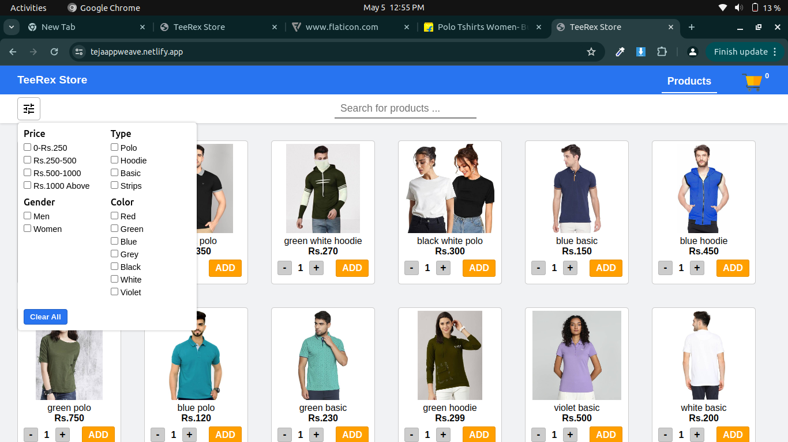
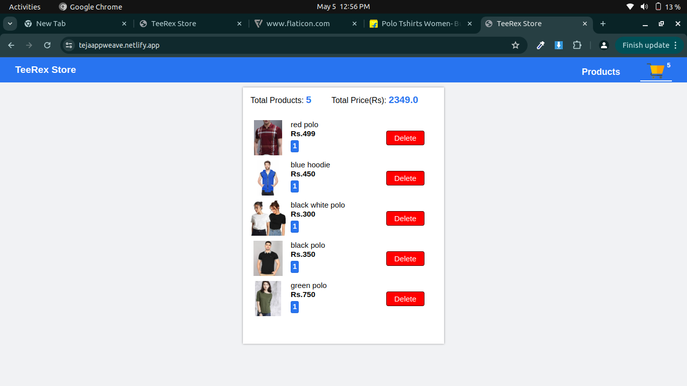

# Appweave_Assignment
A prospective entrepreneur plans to initiate a t-shirt business, focusing on online sales. To facilitate this operation, they seek a basic web application. This application should allow customers to explore the range of t-shirts on offer, select items to add to their virtual shopping cart, and seamlessly proceed to checkout with their chosen items. 
[Appweave_Task_Live](https://tejaappweave.netlify.app)
<h2>Features of this Task: </h2>

Task is to build a simple UI, which allows a customer to do the following:

<ul>
<li>Browse the catalog on a product listing page</li>
<li>Each card should have the image, name and price.</li>
<li>Search using free text which is a combination of one or more of the below attributes (Eg.green polo)</li>
<ul>
  <li>Name</li>
  <li>Color</li>
  <li>Type</li>
</ul>
<li>Filter for t-shirts using specific attributes</li>
<ul>
  <li>Gender</li>
  <li>Color</li>
  <li>Price Range</li>
  <li>Type</li>
</ul>
<li>Filters and Search need not be retained on navigation between pages, But the items in the cart should be retained.</li>
<li>Add one or more t-shirts to the shopping cart</li>
<li>View the shopping cart by clicking the shopping cart icon</li>
<li>Increase quantity or delete items from the shopping cart</li>
<li>Display the total amount in the shopping cart.</li>
<li>Every t-shirt type has a limited quantity. If the customer tries to order more than the available quantity, an error message should appear.</li>
</ul>
<h2>UI Design: </h2>
<h3>Product Listing Page:</h3>

<h3>Shopping Cart - Pre-Checkout Page</h3>

